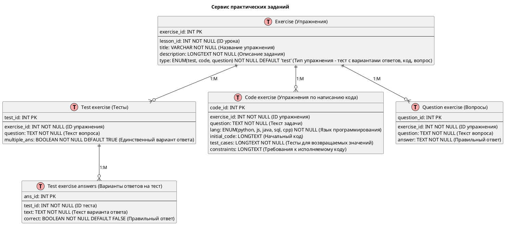

```plantuml
@startuml
!define Table(name,desc) entity name as "desc" << (T,#FFAAAA) >>

title Сервис практических заданий

Table(Exercise, "Exercise (Упражнения)") {
  exercise_id: INT PK
  --
  lesson_id: INT NOT NULL (ID урока)
  title: VARCHAR NOT NULL (Название упражнения)
  description: LONGTEXT NOT NULL (Описание задания)
  type: ENUM(test, code, question) NOT NULL DEFAULT 'test' (Тип упражнения - тест с вариантами ответов, код, вопрос)
}

Table(Test, "Test exercise (Тесты)") {
  test_id: INT PK
  --
  exercise_id: INT NOT NULL (ID упражнения)
  question: TEXT NOT NULL (Текст вопроса)
  multiple_ans: BOOLEAN NOT NULL DEFAULT TRUE (Единственный вариант ответа)
}

Table(Test_ans, "Test exercise answers (Варианты ответов на тест)") {
  ans_id: INT PK
  --
  test_id: INT NOT NULL (ID теста)
  text: TEXT NOT NULL (Текст варианта ответа)
  correct: BOOLEAN NOT NULL DEFAULT FALSE (Правильный ответ)
}

Table(Code, "Code exercise (Упражнения по написанию кода)") {
  code_id: INT PK
  --
  exercise_id: INT NOT NULL (ID упражнения)
  question: TEXT NOT NULL (Текст задачи)
  lang: ENUM(python, js, java, sql, cpp) NOT NULL (Язык программирования)
  initial_code: LONGTEXT (Начальный код)
  test_cases: LONGTEXT NOT NULL (Тесты для возвращаемых значений)
  constraints: LONGTEXT (Требования к исполняемому коду)
}

Table(Question, "Question exercise (Вопросы)") {
  question_id: INT PK
  --
  exercise_id: INT NOT NULL (ID упражнения)
  question: TEXT NOT NULL (Текст вопроса)
  answer: TEXT NOT NULL (Правильный ответ)
}

Exercise ||--o{ Test : "1:M"
Exercise ||--o{ Code : "1:M"
Exercise ||--o{ Question : "1:M"
Test ||--o{ Test_ans : "1:M"

@enduml


```
