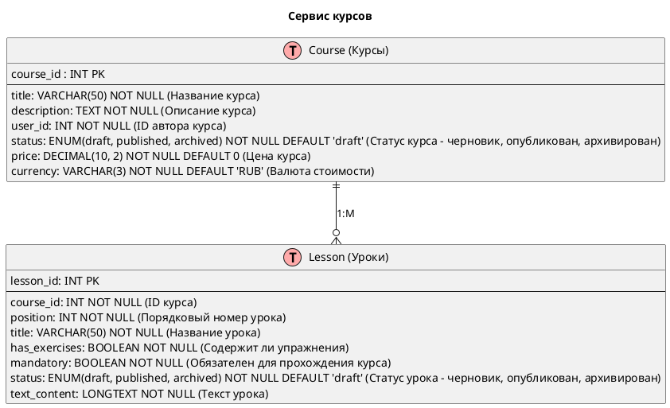

```plantuml
@startuml
!define Table(name,desc) entity name as "desc" << (T,#FFAAAA) >>
title Сервис курсов

Table(Course, "Course (Курсы)") {
  course_id : INT PK
  --
  title: VARCHAR(50) NOT NULL (Название курса)
  description: TEXT NOT NULL (Описание курса)
  user_id: INT NOT NULL (ID автора курса)
  status: ENUM(draft, published, archived) NOT NULL DEFAULT 'draft' (Статус курса - черновик, опубликован, архивирован)
  price: DECIMAL(10, 2) NOT NULL DEFAULT 0 (Цена курса)
  currency: VARCHAR(3) NOT NULL DEFAULT 'RUB' (Валюта стоимости)
}

Table(Lesson, "Lesson (Уроки)") {
  lesson_id: INT PK
  --
  course_id: INT NOT NULL (ID курса)
  position: INT NOT NULL (Порядковый номер урока)
  title: VARCHAR(50) NOT NULL (Название урока)
  has_exercises: BOOLEAN NOT NULL (Содержит ли упражнения)
  mandatory: BOOLEAN NOT NULL (Обязателен для прохождения курса)
  status: ENUM(draft, published, archived) NOT NULL DEFAULT 'draft' (Статус урока - черновик, опубликован, архивирован)
  text_content: LONGTEXT NOT NULL (Текст урока)
}


Course ||--o{ Lesson : "1:M"

@enduml

```
