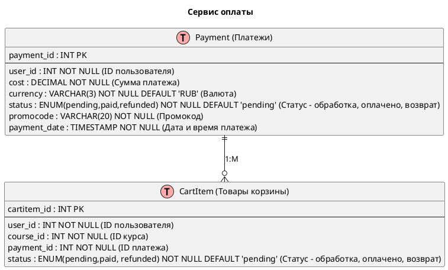

```plantuml
@startuml
!define Table(name,desc) entity name as "desc" << (T,#FFAAAA) >>

title Сервис оплаты

Table(Payment, "Payment (Платежи)") {
  payment_id : INT PK
  --
  user_id : INT NOT NULL (ID пользователя)
  cost : DECIMAL NOT NULL (Сумма платежа)
  currency : VARCHAR(3) NOT NULL DEFAULT 'RUB' (Валюта)
  status : ENUM(pending,paid,refunded) NOT NULL DEFAULT 'pending' (Статус - обработка, оплачено, возврат)
  promocode : VARCHAR(20) NOT NULL (Промокод)
  payment_date : TIMESTAMP NOT NULL (Дата и время платежа)
}

Table(CartItem, "CartItem (Товары корзины)") {
  cartitem_id : INT PK
  --
  user_id : INT NOT NULL (ID пользователя)
  course_id : INT NOT NULL (ID курса)
  payment_id : INT NOT NULL (ID платежа)
  status : ENUM(pending,paid, refunded) NOT NULL DEFAULT 'pending' (Статус - обработка, оплачено, возврат)
}


Payment ||--o{ CartItem : "1:M"

@enduml
```
