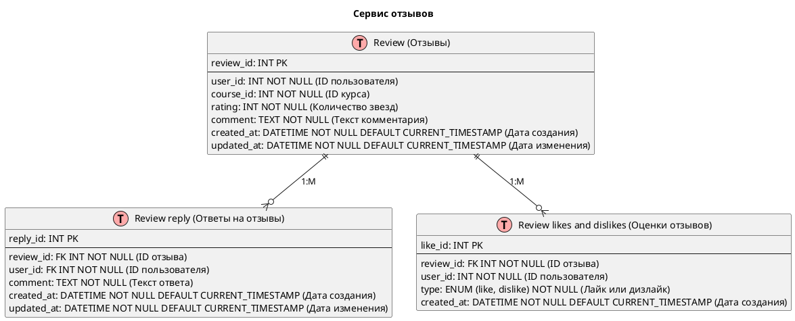

```plantuml
@startuml
!define Table(name,desc) entity name as "desc" << (T,#FFAAAA) >>
title Сервис отзывов

Table(Review, "Review (Отзывы)") {
  review_id: INT PK
  --
  user_id: INT NOT NULL (ID пользователя)
  course_id: INT NOT NULL (ID курса)
  rating: INT NOT NULL (Количество звезд)
  comment: TEXT NOT NULL (Текст комментария)
  created_at: DATETIME NOT NULL DEFAULT CURRENT_TIMESTAMP (Дата создания)
  updated_at: DATETIME NOT NULL DEFAULT CURRENT_TIMESTAMP (Дата изменения)
}

Table(Reply, "Review reply (Ответы на отзывы)") {
  reply_id: INT PK
  --
  review_id: FK INT NOT NULL (ID отзыва)
  user_id: FK INT NOT NULL (ID пользователя)
  comment: TEXT NOT NULL (Текст ответа)
  created_at: DATETIME NOT NULL DEFAULT CURRENT_TIMESTAMP (Дата создания)
  updated_at: DATETIME NOT NULL DEFAULT CURRENT_TIMESTAMP (Дата изменения)
}

Table(Like, "Review likes and dislikes (Оценки отзывов)") {
  like_id: INT PK
  --
  review_id: FK INT NOT NULL (ID отзыва)
  user_id: INT NOT NULL (ID пользователя)
  type: ENUM (like, dislike) NOT NULL (Лайк или дизлайк)
  created_at: DATETIME NOT NULL DEFAULT CURRENT_TIMESTAMP (Дата создания)
}

Review ||--o{ Reply : "1:M"
Review ||--o{ Like : "1:M"


@enduml
```
