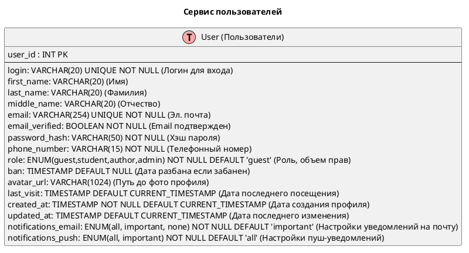

```plantuml
@startuml
!define Table(name,desc) entity name as "desc" << (T,#FFAAAA) >>
title Сервис пользователей

Table(User, "User (Пользователи)") {
  user_id : INT PK
  --
  login: VARCHAR(20) UNIQUE NOT NULL (Логин для входа)
  first_name: VARCHAR(20) (Имя)
  last_name: VARCHAR(20) (Фамилия)
  middle_name: VARCHAR(20) (Отчество)
  email: VARCHAR(254) UNIQUE NOT NULL (Эл. почта)
  email_verified: BOOLEAN NOT NULL (Email подтвержден)
  password_hash: VARCHAR(50) NOT NULL (Хэш пароля)
  phone_number: VARCHAR(15) NOT NULL (Телефонный номер)
  role: ENUM(guest,student,author,admin) NOT NULL DEFAULT 'guest' (Роль, объем прав)
  ban: TIMESTAMP DEFAULT NULL (Дата разбана если забанен)
  avatar_url: VARCHAR(1024) (Путь до фото профиля)
  last_visit: TIMESTAMP DEFAULT CURRENT_TIMESTAMP (Дата последнего посещения)
  created_at: TIMESTAMP NOT NULL DEFAULT CURRENT_TIMESTAMP (Дата создания профиля)
  updated_at: TIMESTAMP DEFAULT CURRENT_TIMESTAMP (Дата последнего изменения)
  notifications_email: ENUM(all, important, none) NOT NULL DEFAULT 'important' (Настройки уведомлений на почту)
  notifications_push: ENUM(all, important) NOT NULL DEFAULT 'all' (Настройки пуш-уведомлений)
}

@enduml
```
