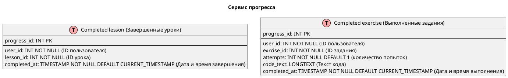

```plantuml
@startuml
!define Table(name,desc) entity name as "desc" << (T,#FFAAAA) >>
title Сервис прогресса

Table(Progress_lesson, "Completed lesson (Завершенные уроки)") {
  progress_id: INT PK
  --
  user_id: INT NOT NULL (ID пользователя)
  lesson_id: INT NOT NULL (ID урока)
  completed_at: TIMESTAMP NOT NULL DEFAULT CURRENT_TIMESTAMP (Дата и время завершения)
}

Table(Progress_exercise, "Completed exercise (Выполненные задания)") {
  progress_id: INT PK
  --
  user_id: INT NOT NULL (ID пользователя)
  exrcise_id: INT NOT NULL (ID задания)
  attempts: INT NOT NULL DEFAULT 1 (количество попыток)
  code_text: LONGTEXT (Текст кода)
  completed_at: TIMESTAMP NOT NULL DEFAULT CURRENT_TIMESTAMP (Дата и время выполнения)
}

@enduml
```
